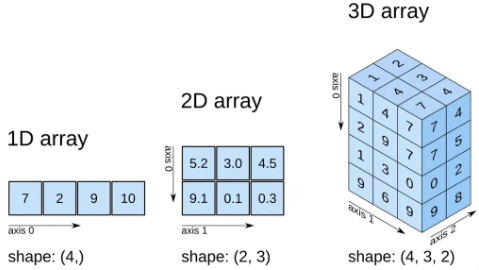
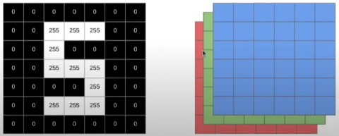

# Uso da Biblioteca NumPy I

## Conceito de Array


Os arrays são estruturas de dados fundamentais na biblioteca NumPy, e podem ser classificados em diferentes dimensões:

- **1D Array**: Unidimensional (lista)
- **2D Array**: Bidimensional (matriz retangular)
- **3D Array**: Tridimensional (estrutura cúbica)

### Dimensões

As dimensões podem ser entendidas como:
- **Altura**
- **Largura**
- **Profundidade**

## Exemplo de Criação de um Array

```python
import numpy as np

a = np.array([1, 25, 4, 33, 9])
a.ndim  # saída: 1
a.shape  # saída: (5,)
``` 

# ----------------------------------------------------------------------------------------

# Imagens

## Imagem em Tons de Cinza



Cada pixel da imagem é representado por um único valor de intensidade luminosa, geralmente variando de 0 (preto) a 255 (branco). 
No caso da imagem acima, seu formato é (7, 7), indicando que é um **array 2D**.

## Imagem RGB

A imagem RGB (Red, Green, Blue) é um tipo de imagem digital onde cada pixel é representado por três valores de intensidade luminosa, um para cada componente de cor: vermelho, verde e azul.
Cada pixel da imagem é uma combinação desses três canais. Esses valores variam de 0 a 255 e representam a quantidade de cada componente de cor presente em um pixel específico.
No caso da imagem acima, seu formato é (6, 6, 3), indicando que é um **array 3D**.
